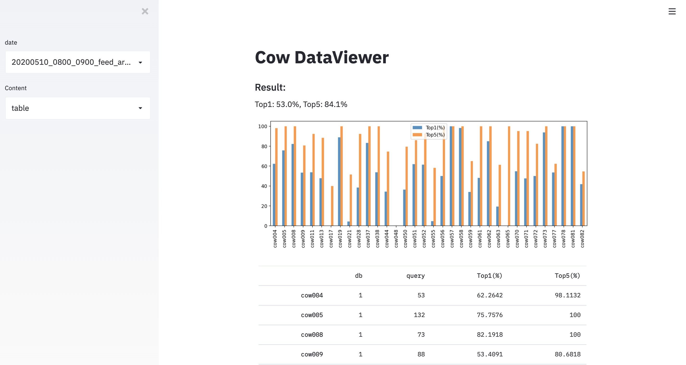
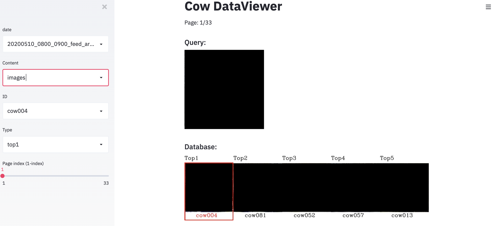

# cow-dataviewer

This library is a rich data viewer.

## Demo

**Table View**


**Images View**


## Get Started

```
git clone https://github.com/pineb1ue/cow-dataviewer
cd cow-dataviewer
streamlit run app.py
```
